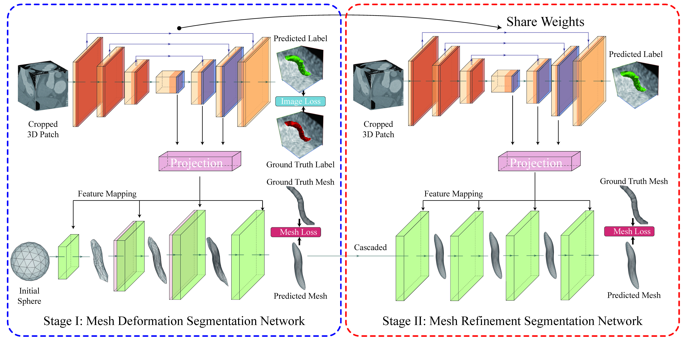
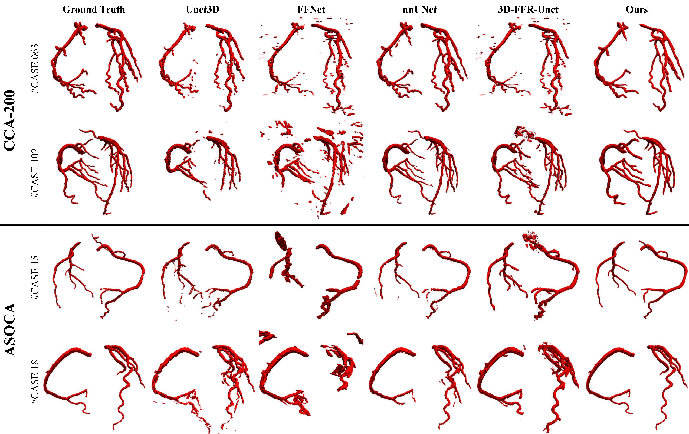

# Segmentation and Vascular Vectorization for Coronary Artery by Geometry-based Cascaded Neural Network

This repository is a PyTorch implementation of geometry-based cascaded neural network proposed in *Segmentation and Vascular Vectorization for Coronary Artery by Geometry-based Cascaded Neural Network* (submitted)

## Abstract

Segmentation of the coronary artery is an important task for the quantitative analysis of coronary computed tomography angiography (CCTA). However, the complex structures with tiny and narrow branches of the coronary artery bring it a great challenge. Coupled with the medical image limitations of low resolution and poor contrast, fragmentations of segmented vessels frequently occur in the prediction. Therefore, we propose a novel geometry-based segmentation network. With the assistance of the regularized mesh annotation, our model is competent for generating complete, smooth and elaborate results of the coronary artery, without the fragmentations of vessels. Extensive experiments verify our method on our collected dataset CCA-200 and public ASOCA dataset, with a Dice of 0.778 on CCA-200 and 0.895 on ASOCA, showing superior results. Especially, our geometry-based model generates an accurate, intact and smooth coronary artery, devoid of any fragmentations of segmented vessels.

## Network



> Fig.1 Our geometry-based cascaded segmentation network for generating mesh of the coronary artery.




> Fig.2 Comparsion Results of Comprehensive Experiments on our collected CCA-200 dataset and public ASOCA dataset with current mainstream methods. Compared with the ASOCA, the coronary artery in our collected CCA-200 has more complicated and elaborate structures, including more multi-forks, and more twisted and narrower branches, which raises higher demand for the segmentation of the coronary artery.

## Installation

PyTorch == 1.11.0

Python == 3.9.12

torch-geometric == 2.1.0

pytorch3d == 0.7.0

pyvista == 0.36.1

trimesh == 3.12.6

## Experiments

train on stage I:

```bash
nohup python -u ./train.py -c "./config/config-s1-train.yaml" > train-s1.log 2>&1 &
```

train on stage II:

```bash
nohup python -u ./train.py -c "./config/config-s2-train.yaml" > train-s2.log 2>&1 &
```

predict:

```bash
nohup python -u ./predict.py -c "./config/config-predict.yaml" > predict.log 2>&1 &
```
